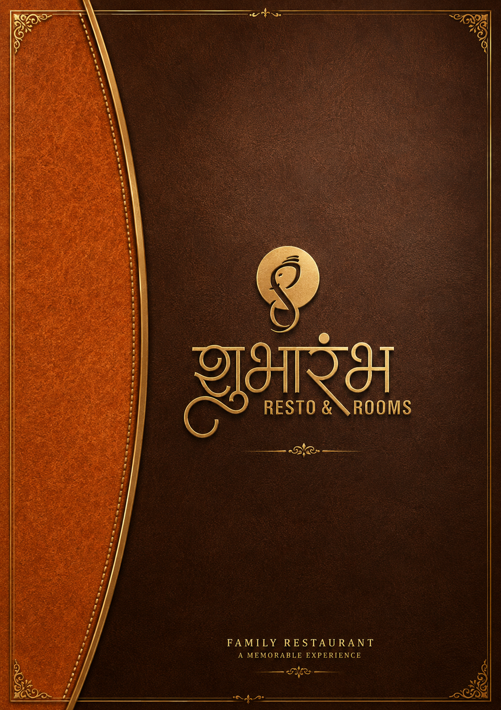

<div align="center">
  
  <h1>🏨 Hotel Shubharambh Lodging & Family Restaurant</h1>
  <p>A Premium, Mobile-First, SEO-Optimized Web Application for a Family Restaurant and Lodging in Kolhapur, Maharashtra.</p>

  
  
  
  

  [](https://hotelshubharambh.com)
</div>

<br />

## 📖 Project Description

**Hotel Shubharambh Lodging & Family Restaurant** is a high-end, professionally designed web application tailored for a premium hospitality business in Kolhapur, Maharashtra. Built with a **Modern UI/UX**, the platform serves as a complete digital presence for a **Family Restaurant** and **Lodging Website**. 

This **Hotel Website** and **Restaurant Website** is fully **Responsive**, blazing fast, and strictly **SEO Optimized**. It features a 3D digital flipbook menu, smooth scroll animations, integrated WhatsApp booking, and semantic local SEO schemas to dominate local search results.

---

## 🌐 Live Website
**Visit the live site here:** [https://hotelshubharambh.com](https://hotelshubharambh.com)

---

## ✨ Features

- **📱 Mobile-First Responsive Website:** flawlessly designed for phones, tablets, and desktops.
- **🚀 Ultra-Fast Performance:** Powered by **React**, **Vite**, and **Tailwind CSS**.
- **🔍 SEO Optimized:** Dynamic Meta Tags, Canonical URLs, and JSON-LD structured schemas (`LocalBusiness`, `Restaurant`, `LodgingBusiness`, `FAQPage`).
- **📖 3D Digital Menu Book:** A highly interactive, swipeable flipbook showcasing the restaurant's wide variety of authentic dishes.
- **📸 Premium Gallery View:** High-quality masonry layouts with optimized lazy-loading for heavy image assets.
- **💬 Seamless Communication:** Floating action buttons for one-click Call and WhatsApp reservations.

---

## 📸 Screenshots

<div align="center">
  
  <p><i>Official 3D Digital Menu Book</i></p>
</div>

---

## 🛠️ Tech Stack

- **Framework:** React 18
- **Build Tool:** Vite
- **Styling:** Tailwind CSS
- **Animations:** Framer Motion
- **Icons:** React Icons
- **Interactive UI:** React-PageFlip
- **SEO & Metadata:** React-Helmet-Async
- **Routing:** React Router DOM

---

## 📂 Folder Structure

```text
Hotel_Shubharambh/
├── public/                 # Static assets (Favicon, Sitemap, Robots.txt)
├── src/
│   ├── assets/             # Images, Videos, Menus, Logos
│   ├── components/         # Reusable UI components (SEO, Navbar, Footer, etc.)
│   ├── pages/              # Main routes (Home, About, Menu, Lodging, Contact)
│   ├── routes/             # App routing logic
│   ├── App.jsx             # Main Application Entry
│   ├── main.jsx            # React DOM render
│   └── index.css           # Global Tailwind directives
├── package.json            # Project dependencies
├── tailwind.config.js      # Tailwind theme and styling rules
└── vite.config.js          # Vite build configuration
```


## 📈 SEO Features

- Proper Marathi `<html lang="mr">` tags.
- Unique Meta Titles and Descriptions for every route.
- Open Graph (OG) and Twitter Card tags.
- Fully implemented `sitemap.xml` and `robots.txt`.
- Highly specific JSON-LD schemas mapping out the Kolhapur business location, pricing, and FAQs.

---

## 📱 Responsive Design

Meticulously crafted using Tailwind's mobile-first breakpoint system (`sm`, `md`, `lg`, `xl`). All components, including the custom flipbook and complex flex grids, scale flawlessly down to 320px screens.

---

## 🌐 Browser Support

- Chrome >= 87
- Firefox >= 78
- Safari >= 13
- Edge >= 88

---

## 🔮 Future Improvements

- [ ] Multi-language support (Marathi / English toggle).
- [ ] Backend integration for real-time room availability.
- [ ] CMS integration for easy menu updates.

---

## 🤝 Contributing

We welcome contributions! Please follow these steps:
1. Fork the project.
2. Create your feature branch (`git checkout -b feature/AmazingFeature`).
3. Commit your changes (`git commit -m 'Add some AmazingFeature'`).
4. Push to the branch (`git push origin feature/AmazingFeature`).
5. Open a Pull Request.

Please read our [CONTRIBUTING.md](CONTRIBUTING.md) and [CODE_OF_CONDUCT.md](CODE_OF_CONDUCT.md) for details.

---

## 📄 License

This project is licensed under the MIT License - see the [LICENSE](LICENSE) file for details. 

> **⚠️ Important Note regarding reuse:** 
> While the code itself is open source under the MIT License, the branding, logos, menu data, and specific photography are proprietary to **Hotel Shubharambh**. If you intend to reuse this repository for another project, please ensure you replace all proprietary assets and obtain explicit permission where applicable.

---

## 🙏 Acknowledgements

- [React](https://reactjs.org/)
- [Tailwind CSS](https://tailwindcss.com/)
- [Vite](https://vitejs.dev/)
- [Framer Motion](https://www.framer.com/motion/)

---

## 👩‍💻 Designed & Developed by

**Shivani Mali**  
*Front-End Developer & UI/UX Enthusiast*

- 🌐 **Portfolio:** [https://shivanis-portfolio-website.vercel.app/](https://shivanis-portfolio-website.vercel.app/)
- 🐙 **GitHub:** [https://github.com/Shivani-mali](https://github.com/Shivani-mali)
- 💼 **LinkedIn:** [Shivani Mali](https://www.linkedin.com/in/shivani-mali/) *(Connect with me!)*

<br />

<div align="center">
  <p>© 2026 Hotel Shubharambh. All Rights Reserved.</p>
</div>
